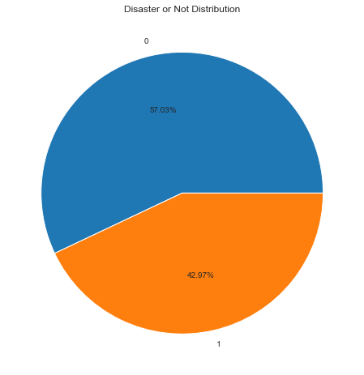
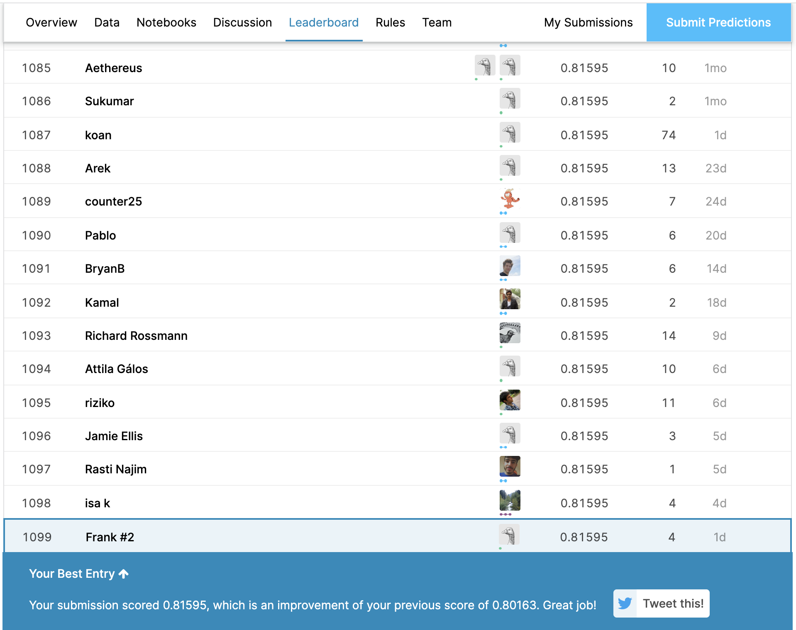

# Real or Not? NLP with Disaster Tweets   
Predict which Tweets are about real disasters and which ones are not
 (Kaggle: https://www.kaggle.com/c/nlp-getting-started/)

### Python Tool Packages


```python
import numpy as np 
import pandas as pd
import re
import nltk
from nltk.stem import PorterStemmer
ps = PorterStemmer()
from nltk.stem.lancaster import LancasterStemmer
lc = LancasterStemmer()
from nltk.stem import SnowballStemmer
sb = SnowballStemmer("english")
from nltk.corpus import stopwords
import string as s
import matplotlib.pyplot as plt
from sklearn.model_selection import cross_val_score
from sklearn.linear_model import LogisticRegression
from sklearn.ensemble import RandomForestClassifier
from sklearn.neighbors import KNeighborsClassifier
from sklearn.naive_bayes import GaussianNB
from sklearn.naive_bayes import MultinomialNB
import spacy
import os
import gc
from keras.preprocessing.text import Tokenizer
from keras.preprocessing.sequence import pad_sequences
from keras.layers import Dense, Input, LSTM, Embedding, Dropout, Activation, GRU, Conv1D, BatchNormalization
from keras.layers import Bidirectional, GlobalMaxPooling1D, Concatenate, SpatialDropout1D
from keras.optimizers import Adam
from keras.models import Sequential
from keras import initializers, regularizers, constraints, optimizers, layers
from keras.initializers import Constant
import pickle
import seaborn as sns
sns.set_style("white")
```
    /Users/faith/anaconda3/envs/tensorflow/lib/python3.6/site-packages/h5py/__init__.py:36: FutureWarning: Conversion of the second argument of issubdtype from `float` to `np.floating` is deprecated. In future, it will be treated as `np.float64 == np.dtype(float).type`.
      from ._conv import register_converters as _register_converters
    Using TensorFlow backend.
    /Users/faith/anaconda3/envs/tensorflow/lib/python3.6/site-packages/tensorflow/python/framework/dtypes.py:519: FutureWarning: Passing (type, 1) or '1type' as a synonym of type is deprecated; in a future version of numpy, it will be understood as (type, (1,)) / '(1,)type'.
      _np_qint8 = np.dtype([("qint8", np.int8, 1)])
    /Users/faith/anaconda3/envs/tensorflow/lib/python3.6/site-packages/tensorflow/python/framework/dtypes.py:520: FutureWarning: Passing (type, 1) or '1type' as a synonym of type is deprecated; in a future version of numpy, it will be understood as (type, (1,)) / '(1,)type'.
      _np_quint8 = np.dtype([("quint8", np.uint8, 1)])
    /Users/faith/anaconda3/envs/tensorflow/lib/python3.6/site-packages/tensorflow/python/framework/dtypes.py:521: FutureWarning: Passing (type, 1) or '1type' as a synonym of type is deprecated; in a future version of numpy, it will be understood as (type, (1,)) / '(1,)type'.
      _np_qint16 = np.dtype([("qint16", np.int16, 1)])
    /Users/faith/anaconda3/envs/tensorflow/lib/python3.6/site-packages/tensorflow/python/framework/dtypes.py:522: FutureWarning: Passing (type, 1) or '1type' as a synonym of type is deprecated; in a future version of numpy, it will be understood as (type, (1,)) / '(1,)type'.
      _np_quint16 = np.dtype([("quint16", np.uint16, 1)])
    /Users/faith/anaconda3/envs/tensorflow/lib/python3.6/site-packages/tensorflow/python/framework/dtypes.py:523: FutureWarning: Passing (type, 1) or '1type' as a synonym of type is deprecated; in a future version of numpy, it will be understood as (type, (1,)) / '(1,)type'.
      _np_qint32 = np.dtype([("qint32", np.int32, 1)])
    /Users/faith/anaconda3/envs/tensorflow/lib/python3.6/site-packages/tensorflow/python/framework/dtypes.py:528: FutureWarning: Passing (type, 1) or '1type' as a synonym of type is deprecated; in a future version of numpy, it will be understood as (type, (1,)) / '(1,)type'.
      np_resource = np.dtype([("resource", np.ubyte, 1)])

### Input data
../train.csv                  7613   
../test.csv                   3263   
../sample_submission.csv      3263  

```python
train_df=pd.read_csv('/Users/faith/Downloads/nlp-getting-started/train.csv')
test_df=pd.read_csv('/Users/faith/Downloads/nlp-getting-started/test.csv')

# Data Information in train and test files
def data_info(d):
    print('number of variables: ',d.shape[1])
    print('number of tweets: ',d.shape[0])
    print('variables names: ')
    print(d.columns)
    print('variables data-types: ')
    print(d.dtypes)
    print('missing values: ')
    c=d.isnull().sum()
    print(c[c>0])
```


```python
data_info(train_df)
```

    number of variables:  5
    number of tweets:  7613
    variables names: 
    Index(['id', 'keyword', 'location', 'text', 'target'], dtype='object')
    variables data-types: 
    id           int64
    keyword     object
    location    object
    text        object
    target       int64
    dtype: object
    missing values: 
    keyword       61
    location    2534
    dtype: int64

### Data Analysis

```python
data_info(test_df)
```

    number of variables:  4
    number of tweets:  3263
    variables names: 
    Index(['id', 'keyword', 'location', 'text'], dtype='object')
    variables data-types: 
    id           int64
    keyword     object
    location    object
    text        object
    dtype: object
    missing values: 
    keyword       26
    location    1105
    dtype: int64


```python
#Graphical display of information distribution
plt.figure(figsize=(8,8))
train_df['target'].value_counts().plot.pie(autopct='%.2f%%')
plt.title('Disaster or Not Distribution')
plt.ylabel('')
plt.show()
```





```python
train_text = train_df['text']
test_text = test_df['text']
target = train_df['target'].values

# combine the text from the training dataset and the test dataset
text_list = pd.concat([train_text, test_text])

# number of training samples
num_train_data = target.shape[0]
```


```python
text_list = text_list.apply(lambda x: re.sub('&amp;', ' and ', x))
text_list = text_list.apply(lambda x: re.sub('w/', 'with', x))
```
### Data Preprocessing

```python
# preprocessing by using spacy
nlp = spacy.load('en_core_web_lg')
nlp.vocab.add_flag(lambda s: s.lower() in spacy.lang.en.stop_words.STOP_WORDS, spacy.attrs.IS_STOP)
docs = nlp.pipe(text_list, n_threads = 2)

# convert words to integers and save the results in word_sequences
word_sequences = []

# store the mapping in word_dict
word_dict = {}
lemma_dict = {}

# store the frequence of each word
word_freq = {}

word_index = 1
for doc in docs:
    word_seq = []
    for word in doc:
        try:
            word_freq[word.text] += 1
        except KeyError:
            word_freq[word.text] = 1
        if (word.text not in word_dict) and (word.pos_ is not 'PUNCT'):
            word_dict[word.text] = word_index
            word_index += 1
            lemma_dict[word.text] = word.lemma_
            
        # do not include punctuations in word_dict
        # this essentially removes hashtags and mentions
        if word.pos_ is not 'PUNCT':
            word_seq.append(word_dict[word.text])
    word_sequences.append(word_seq)
del docs
gc.collect()

# maximum number of words per tweet in the dataset
max_length = max([len(s) for s in word_sequences])

# number of unique words
# add 1 because 0 is reserved for padding
vocab_size = len(word_dict) + 1

train_word_sequences = word_sequences[:num_train_data]
test_word_sequences = word_sequences[num_train_data:]

# add zeros at the end of each word sequence so that their lengths are fixed at max_len
train_word_sequences = pad_sequences(train_word_sequences, maxlen=max_length, padding='post')
test_word_sequences = pad_sequences(test_word_sequences, maxlen=max_length, padding='post')
```

### embedding_matrix

```python
#embedding_matrix
def load_embeddings(embeddings_index, word_dict, lemma_dict):
    embed_size = 300
    vocab_size = len(word_dict) + 1
    embedding_matrix = np.zeros((vocab_size, embed_size), dtype=np.float32)
    unknown_vector = np.zeros((embed_size,), dtype=np.float32) - 1.
    for key in word_dict:
        word = key
        embedding_vector = embeddings_index.get(word)
        if embedding_vector is not None:
            embedding_matrix[word_dict[key]] = embedding_vector
            continue
        word = key.lower()
        embedding_vector = embeddings_index.get(word)
        if embedding_vector is not None:
            embedding_matrix[word_dict[key]] = embedding_vector
            continue
        word = key.upper()
        embedding_vector = embeddings_index.get(word)
        if embedding_vector is not None:
            embedding_matrix[word_dict[key]] = embedding_vector
            continue
        word = key.capitalize()
        embedding_vector = embeddings_index.get(word)
        if embedding_vector is not None:
            embedding_matrix[word_dict[key]] = embedding_vector
            continue
        word = ps.stem(key)
        embedding_vector = embeddings_index.get(word)
        if embedding_vector is not None:
            embedding_matrix[word_dict[key]] = embedding_vector
            continue
        word = lc.stem(key)
        embedding_vector = embeddings_index.get(word)
        if embedding_vector is not None:
            embedding_matrix[word_dict[key]] = embedding_vector
            continue
        word = sb.stem(key)
        embedding_vector = embeddings_index.get(word)
        if embedding_vector is not None:
            embedding_matrix[word_dict[key]] = embedding_vector
            continue
        word = lemma_dict[key]
        embedding_vector = embeddings_index.get(word)
        if embedding_vector is not None:
            embedding_matrix[word_dict[key]] = embedding_vector
            continue
        embedding_matrix[word_dict[key]] = unknown_vector                    
    return embedding_matrix
```
### generate word vector by using Glove

```python
def load_pickle_file(path):
    with open(path, 'rb') as f:
        file = pickle.load(f)
    return file

# the asterisk below allows the function to accept an arbitrary number of inputs
# convert the embedding file into a Python dictionary
def get_coefs(word,*arr): 
    return word, np.asarray(arr, dtype='float32')

#train word vector by using glove                                                  
path_glove = '/Users/faith/Downloads/glove.840B.300d.pkl'
path_paragram = '/Users/faith/Downloads/paragram_300_sl999.txt'

embeddings_index_glove = load_pickle_file(path_glove)
# the asterisks below unpacks the list
embeddings_index_paragram = dict(get_coefs(*o.split(" ")) for o in open(path_paragram, encoding="utf8", errors='ignore') if len(o) > 100)

embedding_matrix_glove = load_embeddings(embeddings_index_glove, word_dict, lemma_dict)
embedding_matrix_paragram = load_embeddings(embeddings_index_paragram, word_dict, lemma_dict)

# stack the two pre-trained embedding matrices
embedding_matrix = np.concatenate((embedding_matrix_glove, embedding_matrix_paragram), axis=1)
```
### build model

```python
embedding_size = 600
learning_rate = 0.001
batch_size = 32
num_epoch = 5

# build model
def build_model(embedding_matrix, vocab_size, max_length, embedding_size=300):
    model = Sequential([
        Embedding(vocab_size, embedding_size, embeddings_initializer=Constant(embedding_matrix), 
                  input_length=max_length, trainable=False),
        SpatialDropout1D(0.3),
        Bidirectional(LSTM(128, return_sequences=True)),
        Conv1D(64, kernel_size=2), 
        GlobalMaxPooling1D(),
        Dense(1, activation='sigmoid')
    ])
    model.compile(optimizer=Adam(lr=0.001), loss='binary_crossentropy', metrics=['accuracy'])
    return model
```
### Training

```python
reps = 5
pred_prob = np.zeros((len(test_word_sequences),), dtype=np.float32)
for r in range(reps):
    model = build_model(embedding_matrix, vocab_size, max_length, embedding_size)
    model.fit(train_word_sequences, target, batch_size=batch_size, epochs=num_epoch, verbose=2)
    pred_prob += np.squeeze(model.predict(test_word_sequences, batch_size=batch_size, verbose=2) / reps)
```

    Epoch 1/5
     - 31s - loss: 0.4662 - acc: 0.7867
    Epoch 2/5
     - 28s - loss: 0.3933 - acc: 0.8299
    Epoch 3/5
     - 27s - loss: 0.3503 - acc: 0.8499
    Epoch 4/5
     - 26s - loss: 0.3091 - acc: 0.8689
    Epoch 5/5
     - 27s - loss: 0.2678 - acc: 0.8914
    Epoch 1/5
     - 36s - loss: 0.4686 - acc: 0.7879
    Epoch 2/5
     - 31s - loss: 0.3927 - acc: 0.8302
    Epoch 3/5
     - 27s - loss: 0.3454 - acc: 0.8531
    Epoch 4/5
     - 27s - loss: 0.3079 - acc: 0.8753
    Epoch 5/5
     - 27s - loss: 0.2585 - acc: 0.8978
    Epoch 1/5
     - 34s - loss: 0.4695 - acc: 0.7823
    Epoch 2/5
     - 27s - loss: 0.3906 - acc: 0.8306
    Epoch 3/5
     - 27s - loss: 0.3504 - acc: 0.8518
    Epoch 4/5
     - 27s - loss: 0.3097 - acc: 0.8726
    Epoch 5/5
     - 27s - loss: 0.2674 - acc: 0.8877
    Epoch 1/5
     - 31s - loss: 0.4692 - acc: 0.7795
    Epoch 2/5
     - 27s - loss: 0.3957 - acc: 0.8269
    Epoch 3/5
     - 27s - loss: 0.3522 - acc: 0.8509
    Epoch 4/5
     - 26s - loss: 0.3125 - acc: 0.8751
    Epoch 5/5
     - 26s - loss: 0.2607 - acc: 0.8922
    Epoch 1/5
     - 30s - loss: 0.4745 - acc: 0.7797
    Epoch 2/5
     - 26s - loss: 0.3912 - acc: 0.8315
    Epoch 3/5
     - 27s - loss: 0.3506 - acc: 0.8522
    Epoch 4/5
     - 26s - loss: 0.3106 - acc: 0.8734
    Epoch 5/5
     - 28s - loss: 0.2621 - acc: 0.8975

### Testing

```python
submission = pd.read_csv('/Users/faith/Downloads/nlp-getting-started/sample_submission.csv')
submission['target'] = pred_prob.round().astype(int)
submission.to_csv('/Users/faith/Downloads/submission.csv', index=False)
```
## Final Ranking

