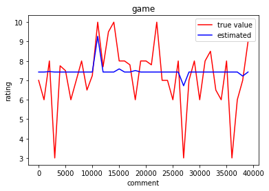
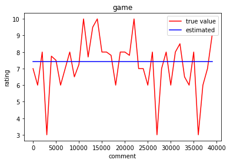
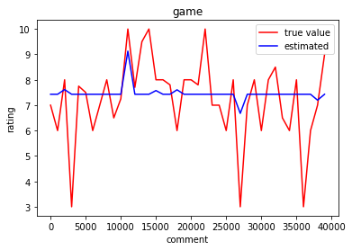
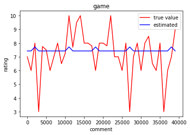
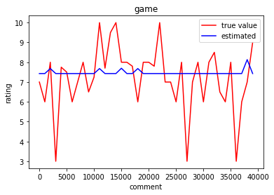
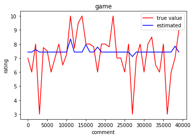

{}Download the notebook{}
{}Download the PDF{}
# Predicting the Rating through Comment
## Data Mining Term Project
## Haibo Wang
## 1001778514

## Data: https://www.kaggle.com/jvanelteren/boardgamegeek-reviews
## Youtube Video: https://youtu.be/9Zj7hmtUeFI
## Github: https://github.com/Wanghb25/PredictRating.git

```python
import pandas as pd 
#from pandas import Series, DataFrame 
import numpy as np 
import matplotlib.pyplot as plt 
import matplotlib as mpl 
import sklearn
from sklearn.linear_model import LinearRegression 
from sklearn.linear_model import Ridge 
from sklearn.linear_model import Lasso 
from sklearn.linear_model import ElasticNetCV 
from sklearn.tree import DecisionTreeRegressor
from sklearn.metrics import mean_squared_error #MSE
from sklearn.metrics import mean_absolute_error #MAE
from sklearn.metrics import r2_score
from sklearn import metrics
from sklearn.model_selection import train_test_split
#from keras.preprocessing.sequence import pad_sequences
```


```python
# load data
def read_data(file_path = 'bgg-13m-reviews.csv'):
    
    df = pd.read_csv(file_path,  names=['index', 'user', 'rating', 'comment', 'id', 'name'])
    df = df.dropna(axis=0, how='any')
    df = df[0:400000]
    print(df.shape)
    return df

# data preprocessing and tokenize
def sentence2tokens(sentence):
    stoplist = set('for a of the and to in ! “ ‘ # $ % & ( )'.split())
    tokens = [word for word in sentence.split(" ") if (word not in stoplist)]
    return tokens

# generate the vector of a sentence
def sentence2vector(sentence, model):
    tokens = sentence2tokens(sentence)
    try:
        vectors = model[tokens]
        return np.mean(vectors, axis=0)
    except:
        return np.zeros(300)
    
# generate the vector of a corpus
def corpus2vector(corpus, model):
    MAX_NB_WORDS = 10000
    MAX_SEQUENCE_LENGTH = 300

    corpus_vectors = np.array([sentence2vector(comment, model) for comment in corpus])
    corpus_vectors = np.array([v for v in corpus_vectors if np.sum(v != None)])          
    return corpus_vectors

# Standardization
def uniform_norm(X):
    X_max = X.max(axis=0)
    X_min = X.min(axis=0)
    return (X - X_min) / (X_max - X_min), X_max, X_min

# Visualization
def draw(pred,test_Y):
    t = np.arange(0, len(pred),1000) 
    plt.figure() 

    plt.plot(t, test_Y[::1000], 'red', label='true value') 
    plt.plot(t, pred[::1000], 'blue', label='estimated') 

    plt.legend(loc='best') 
    plt.title('game') 
    plt.xlabel('comment') 
    plt.ylabel('rating')  
    plt.show()


```

## Word2vec -- GoogleNews-vectors-negative300.bin


```python
# import word2vec to use word embedding    
import gensim
word_model = gensim.models.KeyedVectors.load_word2vec_format('GoogleNews-vectors-negative300.bin', binary=True) 

```

## convert the csv to dataframe


```python
data = read_data()


X = data['comment']
Y = data['rating']
```

    /Users/faith/anaconda3/envs/tensorflow/lib/python3.6/site-packages/IPython/core/interactiveshell.py:2903: DtypeWarning: Columns (2,4) have mixed types.Specify dtype option on import or set low_memory=False.
      if self.run_code(code, result):


    (400000, 6)


```python
data.head()
```


<div>
<style scoped>
    .dataframe tbody tr th:only-of-type {
        vertical-align: middle;
    }

    .dataframe tbody tr th {
        vertical-align: top;
    }

    .dataframe thead th {
        text-align: right;
    }
</style>
<table border="1" class="dataframe">
  <thead>
    <tr style="text-align: right;">
      <th></th>
      <th>index</th>
      <th>user</th>
      <th>rating</th>
      <th>comment</th>
      <th>id</th>
      <th>name</th>
    </tr>
  </thead>
  <tbody>
    <tr>
      <th>3</th>
      <td>2.0</td>
      <td>dougthonus</td>
      <td>10.0</td>
      <td>Currently, this sits on my list as my favorite...</td>
      <td>13</td>
      <td>Catan</td>
    </tr>
    <tr>
      <th>4</th>
      <td>3.0</td>
      <td>cypar7</td>
      <td>10.0</td>
      <td>I know it says how many plays, but many, many ...</td>
      <td>13</td>
      <td>Catan</td>
    </tr>
    <tr>
      <th>8</th>
      <td>7.0</td>
      <td>hreimer</td>
      <td>10.0</td>
      <td>i will never tire of this game.. Awesome</td>
      <td>13</td>
      <td>Catan</td>
    </tr>
    <tr>
      <th>12</th>
      <td>11.0</td>
      <td>daredevil</td>
      <td>10.0</td>
      <td>This is probably the best game I ever played. ...</td>
      <td>13</td>
      <td>Catan</td>
    </tr>
    <tr>
      <th>17</th>
      <td>16.0</td>
      <td>hurkle</td>
      <td>10.0</td>
      <td>Fantastic game. Got me hooked on games all ove...</td>
      <td>13</td>
      <td>Catan</td>
    </tr>
  </tbody>
</table>
</div>


```python
X[0:10]
```


    3     Currently, this sits on my list as my favorite...
    4     I know it says how many plays, but many, many ...
    8              i will never tire of this game.. Awesome
    12    This is probably the best game I ever played. ...
    17    Fantastic game. Got me hooked on games all ove...
    18    One of the best games ever created. Period. Ne...
    20    Game itself is 9. Only strategy game my family...
    21    This is a great game.  I've even got a number ...
    22    One of my all time favorite games. I usually o...
    26    Settlers is a gem. If you havn't played it I s...
    Name: comment, dtype: object


```python
Y[0:10]
```


    3     10.0
    4     10.0
    8     10.0
    12    10.0
    17    10.0
    18    10.0
    20    10.0
    21    10.0
    22    10.0
    26    10.0
    Name: rating, dtype: object


## Divided into training set and test set
## Standardization


```python
# Divided into training set and test set
train_X, test_X, train_Y, test_Y = train_test_split(X,Y, test_size = 0.1, random_state = 42)

train_X = corpus2vector(train_X, word_model)
test_X = corpus2vector(test_X, word_model)

unif_train_X, max_X, min_X = uniform_norm(train_X)
unif_test_X = (test_X - min_X) / (max_X - min_X)
```


```python
train_X
```


    array([[ 0.        ,  0.        ,  0.        , ...,  0.        ,
             0.        ,  0.        ],
           [ 0.        ,  0.        ,  0.        , ...,  0.        ,
             0.        ,  0.        ],
           [ 0.01431885,  0.12670898, -0.07094727, ..., -0.04813232,
             0.01752624,  0.01533203],
           ...,
           [-0.06306966, -0.00065104,  0.04785156, ..., -0.07063802,
             0.08671061, -0.03645833],
           [ 0.        ,  0.        ,  0.        , ...,  0.        ,
             0.        ,  0.        ],
           [ 0.        ,  0.        ,  0.        , ...,  0.        ,
             0.        ,  0.        ]])


```python
unif_train_X
```


    array([[0.50146628, 0.54035088, 0.5497076 , ..., 0.53454545, 0.42857143,
            0.52892562],
           [0.50146628, 0.54035088, 0.5497076 , ..., 0.53454545, 0.42857143,
            0.52892562],
           [0.51221591, 0.65416667, 0.47889863, ..., 0.48973864, 0.44347747,
            0.53973829],
           ...,
           [0.45411779, 0.53976608, 0.59746589, ..., 0.46878788, 0.50231866,
            0.50321396],
           [0.50146628, 0.54035088, 0.5497076 , ..., 0.53454545, 0.42857143,
            0.52892562],
           [0.50146628, 0.54035088, 0.5497076 , ..., 0.53454545, 0.42857143,
            0.52892562]])


## Training different regression models


```python
# Linear regression model
model1 = LinearRegression()
# Ridge regression model
model2 = Ridge()
# Lasso regression model
model3 = Lasso()
# ElasticNetCV model
model4 = ElasticNetCV()

# different depth of decision tree regressor
model5 = DecisionTreeRegressor(max_depth = 1)
model6 = DecisionTreeRegressor(max_depth = 3)
model7 = DecisionTreeRegressor(max_depth = 6)
```


```python
model1.fit(unif_train_X, train_Y)
model2.fit(unif_train_X, train_Y)
model3.fit(unif_train_X, train_Y)
model4.fit(unif_train_X, train_Y)
model5.fit(unif_train_X, train_Y)
model6.fit(unif_train_X, train_Y)
model7.fit(unif_train_X, train_Y)

```


    DecisionTreeRegressor(ccp_alpha=0.0, criterion='mse', max_depth=6,
                          max_features=None, max_leaf_nodes=None,
                          min_impurity_decrease=0.0, min_impurity_split=None,
                          min_samples_leaf=1, min_samples_split=2,
                          min_weight_fraction_leaf=0.0, presort='deprecated',
                          random_state=None, splitter='best')


## Test models


```python
#pred_train = model.predict(unif_train_X)
pred1 = model1.predict(unif_test_X)
pred2 = model2.predict(unif_test_X)
pred3 = model3.predict(unif_test_X)
pred4 = model4.predict(unif_test_X)
pred5 = model5.predict(unif_test_X)
pred6 = model6.predict(unif_test_X)
pred7 = model7.predict(unif_test_X)

print("LinearRegression------")
print("MSE1", mean_squared_error(test_Y, pred1))
print("RMSE1",np.sqrt(mean_squared_error(test_Y,pred1)))
print("MAE1", metrics.mean_absolute_error(test_Y, pred1))

print("***********************")
print("Ridge------")
print("MSE2 ", mean_squared_error(test_Y, pred2))
print("RMSE2",np.sqrt(mean_squared_error(test_Y,pred2)))
print("MAE2", metrics.mean_absolute_error(test_Y, pred2))

print("***********************")
print("Lasso------")
print("MSE3", mean_squared_error(test_Y, pred3))
print("RMSE3",np.sqrt(mean_squared_error(test_Y,pred3)))
print("MAE3", metrics.mean_absolute_error(test_Y, pred3))

print("***********************")
print("ElasticNetCV------")
print("MSE4", mean_squared_error(test_Y, pred4))
print("RMSE4",np.sqrt(mean_squared_error(test_Y,pred4)))
print("MAE4", metrics.mean_absolute_error(test_Y, pred4))

print("***********************")
print("DecisionTreeRegressor(max_depth = 1)------")
print("MSE5", mean_squared_error(test_Y, pred5))
print("RMSE5",np.sqrt(mean_squared_error(test_Y,pred5)))
print("MAE5", metrics.mean_absolute_error(test_Y, pred5))

print("***********************")
print("DecisionTreeRegressor(max_depth = 3)------")
print("MSE6 ", mean_squared_error(test_Y, pred6))
print("RMSE6",np.sqrt(mean_squared_error(test_Y,pred6)))
print("MAE6", metrics.mean_absolute_error(test_Y, pred6))

print("***********************")
print("DecisionTreeRegressor(max_depth = 6)------")
print("MSE7 ", mean_squared_error(test_Y, pred7))
print("RMSE7",np.sqrt(mean_squared_error(test_Y,pred7)))
print("MAE7", metrics.mean_absolute_error(test_Y, pred7))
```

    LinearRegression------
    MSE1 2.885424347103564
    RMSE1 1.6986536866305515
    MAE1 1.3083312347715774
    ***********************
    Ridge------
    MSE2  2.8854158441665443
    RMSE2 1.6986511837827518
    MAE2 1.3083306964122337
    ***********************
    Lasso------
    MSE3 2.915484791934709
    RMSE3 1.7074790751088895
    MAE3 1.3161503162305628
    ***********************
    ElasticNetCV------
    MSE4 2.8857893026017605
    RMSE4 1.6987611081614038
    MAE4 1.3084938562501078
    ***********************
    DecisionTreeRegressor(max_depth = 1)------
    MSE5 2.912975735578299
    RMSE5 1.706744191605262
    MAE5 1.316152065996292
    ***********************
    DecisionTreeRegressor(max_depth = 3)------
    MSE6  2.907673685531794
    RMSE6 1.7051902197502171
    MAE6 1.3151368087476631
    ***********************
    DecisionTreeRegressor(max_depth = 6)------
    MSE7  2.9015798695125588
    RMSE7 1.7034024390943436
    MAE7 1.3126547281562675


## Visualization of Deviation

```python
draw(pred1,test_Y)
draw(pred2,test_Y)
draw(pred3,test_Y)
draw(pred4,test_Y)
draw(pred5,test_Y)
draw(pred6,test_Y)
draw(pred7,test_Y)
```




















```python
text1 = "Fantastic game. Got me hooked on games all over again."
```


```python
def rating(text):
    vec = corpus2vector(text, word_model)
    #s = pad_sequences(tokenized, maxlen=maxlen)
    pred = model2.predict(vec)
#     if pred > 10:
#         return 10
    return pred
```


```python
rating([text1])
```


    array([10.51221594])


```python


```
